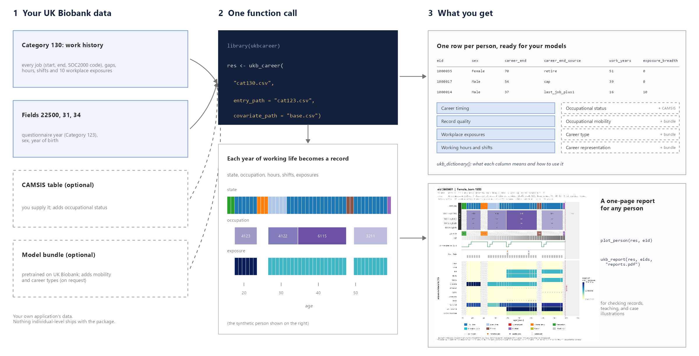
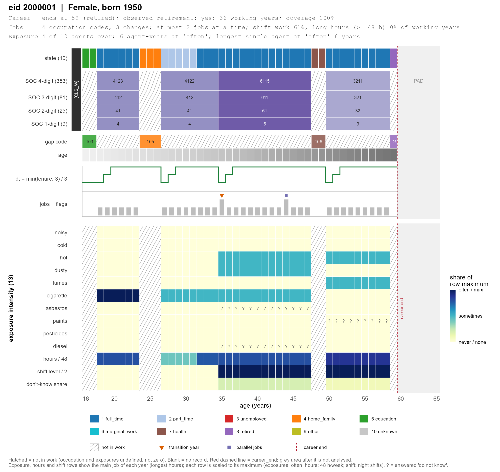

# ukbcareer 

<!-- badges: start -->
[](https://www.r-project.org/)
[](LICENSE)
[](DESCRIPTION)
<!-- badges: end -->

**Turn the UK Biobank lifetime work history into analysis-ready variables, in one line of R.**

UK Biobank participants reported every job they ever held and every break
between jobs, with working hours, shift work and ten workplace exposures
(Category 130). That is a rich record, but it arrives as hundreds of sparse
columns with UK Biobank's special codes. `ukbcareer` does the cleaning and
the bookkeeping for you and returns **one row per person** with variables you
can put straight into a regression, a survival model or a sequence analysis:
when and how the career ended, years worked, cumulative exposures, shift work
and long hours, occupational status, occupational mobility and data-quality
flags. It also draws a **one-page picture of any participant's career**.

It is written for epidemiologists and social scientists. You do not need to
know anything about machine learning to use it.

<p align="center">
  
</p>

## Highlights

- **One function, one table.** `ukb_career()` goes from your CSV exports to a
  tidy `data.table`, one row per participant.
- **Documented variables.** `ukb_dictionary()` tells you what every column
  means, what it needs and how to interpret it.
- **See the person behind the numbers.** `plot_person()` draws the whole work
  history of one participant: states, occupation codes, gaps, hours, shifts
  and exposures, year by year.
- **The traps are handled for you.** UK Biobank's negative codes are ordinal
  levels rather than missing values, job slots are sparse arrays, and the end
  of the career depends on a field that lives outside Category 130. Getting
  any of these wrong silently corrupts the variables; the package gets them
  right and `ukb_qc()` checks them.
- **Comparable across studies.** Definitions follow the accompanying paper
  and are verified against the original pipeline row by row.
- **Works without the model.** Everything except mobility and career types
  needs only your own CSV files.

## Installation

```r
# install.packages("remotes")
remotes::install_github("jiezhang-cn/ukbcareer")

# for the plots
install.packages(c("ggplot2", "patchwork"))
```

Only `data.table` and `jsonlite` are required. Other packages are needed only
for particular features, and the package tells you when one is missing.

## Quick start (no UK Biobank data needed)

The package ships with synthetic participants, so you can try everything in a
minute:

```r
library(ukbcareer)

d   <- ukb_synth(n = 200)      # 200 synthetic people; replace with your CSV
res <- ukb_career(d)           # one row per person
res
```

What does a column mean?

```r
ukb_dictionary()                       # every variable, grouped
ukb_dictionary("career_end_source")    # one variable in full
```

```
career_end_source
  group: Career timing  |  ukb_career(what = "core")  |  needs your CSVs
  How career_end was determined: "retire", "last_job_plus1" or "cap".
  Use: retire = retired (an event); cap = still working at the questionnaire
       (censored); last_job_plus1 = stopped working with no retirement
       record ...
```

Look at one person:

```r
plot_person(res, eid = attr(d, "showcase_eid"))
ukb_report(res, eid = res$eid[1:20], file = "reports.pdf")   # many people, one page each
```

<p align="center">
  
</p>

*A synthetic participant: education, then full-time work, a family break,
part-time work, a health break and retirement at 59. The top half shows the
annual state and the occupation codes (at four levels of the SOC2000
hierarchy); the bottom half shows exposure, hours and shift intensity for
the main job of each year. Hatched years are years not in work.*

## Using your own UK Biobank data

You need three CSV files from your own application:

| File | What must be in it | Why |
| --- | --- | --- |
| **Work history** | Category 130 in full: jobs, gaps, hours, shifts, exposures (fields 22599-22661) | the raw material |
| **Questionnaire date** | field **22500** "When occupational data entered" (it is in **Category 123**, not 130) | defines when the record stops. Without it about 2 years are added to every ongoing job and the observed retirement rate halves |
| **Baseline** | field **31** sex and field **34** year of birth | sex-specific models and the age axis |

Occupation must be field **22617** (4-digit SOC2000), not 22601 (the 8-digit
OSCAR code). Columns are expected to be named like `Year_job_started__0_3`
(field title, instance, array index). If your export uses different names,
map them with `ukb_worklife(fields = list(...))`.

```r
res <- ukb_career("ukb_cat130.csv",
                  entry_path     = "ukb_cat123.csv",
                  covariate_path = "ukb_baseline.csv")

ukb_qc(res)          # check the data before using the results
```

Then merge `res` with your outcomes and covariates by `eid`.

Want occupational status? Supply a CAMSIS table (it is not distributed with
the package; see `?ukb_camsis`):

```r
res <- ukb_career("ukb_cat130.csv", entry_path = "ukb_cat123.csv",
                  covariate_path = "ukb_baseline.csv",
                  camsis_path = "camsis_soc2000.csv",
                  what = c("core", "exposure", "camsis"))
```

## Which variables you get

Run `ukb_dictionary()` for the full list, with an interpretation note for every
variable.

| Group | Key variables | Needs |
| --- | --- | --- |
| **Career timing** | `career_end`, `career_end_source`, `retire_age`, `observed_retirement`, `work_years`, `max_parallel` | your CSVs |
| **Record quality** | `coverage`, `flag_incomplete`, `n_obs_years`, `first_year`, `last_year` | your CSVs |
| **Workplace exposures** (noise, cold, heat, dust, fumes, passive smoke, asbestos, paints, pesticides, diesel) | `yrs_exp_<agent>`, `yrs_high_<agent>`, `peak_<agent>`, `mean_<agent>`, `exposure_breadth`, `high_exposure_years` | your CSVs |
| **Working hours and shifts** | `long_hours_years`, `long_hours_frac`, `shift_years`, `night_shift_years`, `shift_frac` | your CSVs |
| **Occupational status** | `camsis_mean`, `camsis_first`, `camsis_last`, `camsis_change`, `camsis_slope`, `camsis_pattern` | a CAMSIS table |
| **Occupational mobility** | `n_moves`, `mean_jump`, `net_displacement`, `max_single_jump`, `first_move_rel` | the model bundle |
| **Career type** | `type`: groups of people with similar whole careers, found in *your* sample | the model bundle + `torch`, `igraph` |
| **Career representation** | `z001` ... `z192`: a numeric summary of the whole career | the model bundle + `torch` |

Besides the one-row-per-person table you can get the **annual person-year
panel** (`attr(res, "worklife")$annual`) and **nine-state annual sequences**
for sequence analysis (`ukb_states()`, `as_seqdef()` for TraMineR).

### Four things to know when interpreting

1. **Always keep `career_end_source` next to `career_end`.** `"retire"` means
   the person retired: an event. `"cap"` means they were still working when
   they filled in the questionnaire: the career is censored, not over.
   Treating the two alike equates "retired at 53" with "still working at 53".
2. **"Do not know" is not "never".** `peak_<agent>` is `NA` when every answer
   was "do not know", so unknown and unexposed stay distinct.
3. **Check `flag_incomplete`.** People who documented less than half of their
   working-age years are flagged; exclude them in a sensitivity analysis.
4. **Career types are found in your sample, not assigned from ours.** Your
   type 3 is not the paper's type 3, and the grouping is only moderately
   stable (on the reference cohort the bootstrap ARI was 0.52 for women and
   0.62 for men; on a sample of about 1,000 people different random seeds gave
   0.28 to 0.73). Describe the types before using them
   (`plot_type_mix()`, `plot_chronogram()`) and prefer the continuous
   variables above for primary analyses.

## Plots

All plots return ggplot objects; save them with `ukb_save()`.

| Function | Shows |
| --- | --- |
| `plot_person()`, `ukb_report()` | one participant's whole work history on one page |
| `plot_career()` | a compact one-line timeline for one participant |
| `plot_states()` | annual state sequences for many people |
| `plot_chronogram()` | share of people in each state at each age |
| `plot_exposure()` | exposure summaries by group |
| `plot_flows()` | occupational flows over the life course on a status axis (needs CAMSIS) |
| `plot_type_mix()`, `plot_type_profiles()` | what each career type looks like (needs the bundle) |
| `plot_qc()` | the quality checks of `ukb_qc()` |

## The optional model bundle

Occupational mobility, the career representation and career types use a
model pretrained on the UK Biobank reference cohort. Because the model is
derived from UK Biobank data, it is **not shipped with the package**. It is
available on request to researchers with their own UK Biobank application.
It contains no individual-level data. See [BUNDLE-ACCESS.md](BUNDLE-ACCESS.md).

```r
b   <- ukb_bundle("~/ukbcareer_bundle_v5.0")   # checks every file
ukb_bundle_info(b)                              # read before using `type`
res <- ukb_career("ukb_cat130.csv", entry_path = "ukb_cat123.csv",
                  covariate_path = "ukb_baseline.csv", bundle = b,
                  what = c("core", "exposure", "movement", "type"))
```

## Learn more

- `vignette("ukbcareer")`: getting started, from CSV files to a first analysis.
- `vignette("variables")`: every derived variable and how to use it.
- `?ukb_career`, `?plot_person`, `?ukb_dictionary`: help for the main functions.

## Data protection

The package contains **no UK Biobank data**. All examples, tests and figures
in this repository use synthetic participants from `ukb_synth()`. Run the
package on your own approved data, inside your own environment, and follow
your UK Biobank Material Transfer Agreement when sharing derived variables.

## Citation

If you use `ukbcareer`, please cite the paper it accompanies:

> Zhang J, et al. Lifetime occupational histories associated divergent
> pathways to biological ageing and health outcomes. (in preparation)

`citation("ukbcareer")` gives the current entry.

## Getting help

Questions, bug reports and suggestions are welcome on the
[issue tracker](https://github.com/jiezhang-cn/ukbcareer/issues). Please do
**not** paste real UK Biobank data into an issue; reproduce the problem with
`ukb_synth()` instead.
